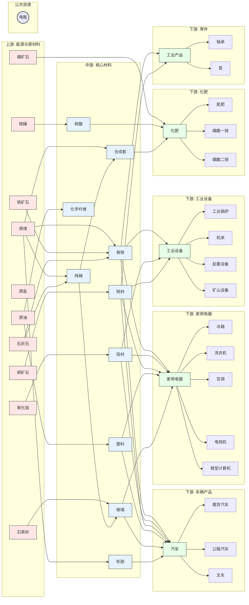

```mermaid
graph LR;

    subgraph A [上游: 能源与原材料]
        A1[原煤];
        A2[原油];
        A3[铁矿石];
        A4[铜矿石];
        A5[原盐];
        A6[硫磺];
        A7[石英砂];
        A8[石灰石];
        A9[磷矿石];
        A10[氧化铝];
    end

    subgraph B [中游: 核心材料]
        B1[钢铁];
        B2[铝材];
        B3[铜材];
        B4[纯碱];
        B5[硫酸];
        B6[合成氨];
        B7[塑料];
        B8[化学纤维];
        B9[玻璃];
        B10[轮胎];
    end

    subgraph C [下游: 车辆产品]
        C1[汽车]
        C1 --> C1_1[载货汽车];
        C1 --> C1_2[公路汽车];
        C1 --> C1_3[叉车];
    end

    subgraph D [下游: 家用电器]
        D1[家用电器];
        D1 --> D1_1[冰箱];
        D1 --> D1_2[洗衣机];
        D1 --> D1_3[空调];
        D1 --> D1_4[电视机];    
        D1 --> D1_5[微型计算机];
    end

    subgraph E [下游: 工业设备]
        E1[工业设备];
        E1 --> E1_1[工业锅炉];
        E1 --> E1_2[机床];
        E1 --> E1_3[起重设备];
        E1 --> E1_4[矿山设备];
    end

    subgraph F [下游: 化肥]
        F1[化肥];
        F1 --> F1_1[氮肥];
        F1 --> F1_2[磷酸一铵];
        F1 --> F1_3[磷酸二铵];
    end
    
    subgraph G [下游: 零件]
        G1[工业产品];
        G1 --> G1_1[轴承];
        G1 --> G1_2[泵];
    end

    subgraph P [公共资源]
        P1((电能));
    end

    %% 上游原材料到中游基础材料的连接
    %% 原煤 → 钢铁 (0.27)
    A1 --> B1;
    %% 铁矿石 → 钢铁 (1.8)
    A3 --> B1;
    %% 石灰石 → 钢铁 (0.4)
    A8 --> B1;

    %% 氧化铝 → 铝材 (1.95)
    A10 --> B2;

    %% 铜矿石 → 铜材 (25)
    A4 --> B3;

    %% 原煤 → 纯碱 (0.0675)
    A1 --> B4;
    %% 石灰石 → 纯碱 (0.6)
    A8 --> B4;

    %% 硫磺 → 硫酸 (0.33)
    A6 --> B5;

    %% 原煤 → 合成氨 (1)
    A1 --> B6;
    %% 纯碱 → 合成氨 (0.175)
    B4 --> B6;

    %% 原油 → 塑料 (2.5)
    A2 --> B7;
    %% 原油 → 化学纤维 (0.9)
    A2 --> B8;

    %% 石英砂 → 玻璃 (0.035)
    A7 --> B9;
    %% 纯碱 → 玻璃 (0.01)
    B4 --> B9;

    %% 原煤 → 轮胎 (0.004)
    A1 --> B10;

    %% 中游材料到下游产品的连接

    %% 汽车
    B1 --> C1; B2 --> C1; B3 --> C1; B7 --> C1; B9 --> C1; B10 --> C1;

    %% 家用电器
    B1 --> D1; B2 --> D1; B3 --> D1; B7 --> D1; B9 --> D1; 

    %% 工业设备
    B1 --> E1; B2 --> E1; B3 --> E1; 

    %% 零件
    B1 --> G1; B3 --> G1;

    %% 化肥
    A9 --> F1; B5 --> F1; B6 --> F1;

    %% 为"电能"节点设置独立样式
    style P1 fill:#e6e6fa,stroke:#333,stroke-width:2px;
    
    %% 为不同层级设置颜色
    style A1 fill:#ffe6e6,stroke:#333,stroke-width:1px;
    style A2 fill:#ffe6e6,stroke:#333,stroke-width:1px;
    style A3 fill:#ffe6e6,stroke:#333,stroke-width:1px;
    style A4 fill:#ffe6e6,stroke:#333,stroke-width:1px;
    style A5 fill:#ffe6e6,stroke:#333,stroke-width:1px;
    style A6 fill:#ffe6e6,stroke:#333,stroke-width:1px;
    style A7 fill:#ffe6e6,stroke:#333,stroke-width:1px;
    style A8 fill:#ffe6e6,stroke:#333,stroke-width:1px;
    style A9 fill:#ffe6e6,stroke:#333,stroke-width:1px;
    style A10 fill:#ffe6e6,stroke:#333,stroke-width:1px;
    
    style B1 fill:#e6f3ff,stroke:#333,stroke-width:1px;
    style B2 fill:#e6f3ff,stroke:#333,stroke-width:1px;
    style B3 fill:#e6f3ff,stroke:#333,stroke-width:1px;
    style B4 fill:#e6f3ff,stroke:#333,stroke-width:1px;
    style B5 fill:#e6f3ff,stroke:#333,stroke-width:1px;
    style B6 fill:#e6f3ff,stroke:#333,stroke-width:1px;
    style B7 fill:#e6f3ff,stroke:#333,stroke-width:1px;
    style B8 fill:#e6f3ff,stroke:#333,stroke-width:1px;
    style B9 fill:#e6f3ff,stroke:#333,stroke-width:1px;
    style B10 fill:#e6f3ff,stroke:#333,stroke-width:1px;
    
    style C1 fill:#e6ffe6,stroke:#333,stroke-width:1px;
    style D1 fill:#e6ffe6,stroke:#333,stroke-width:1px;
    style E1 fill:#e6ffe6,stroke:#333,stroke-width:1px;
    style F1 fill:#e6ffe6,stroke:#333,stroke-width:1px;
    style G1 fill:#e6ffe6,stroke:#333,stroke-width:1px;

```